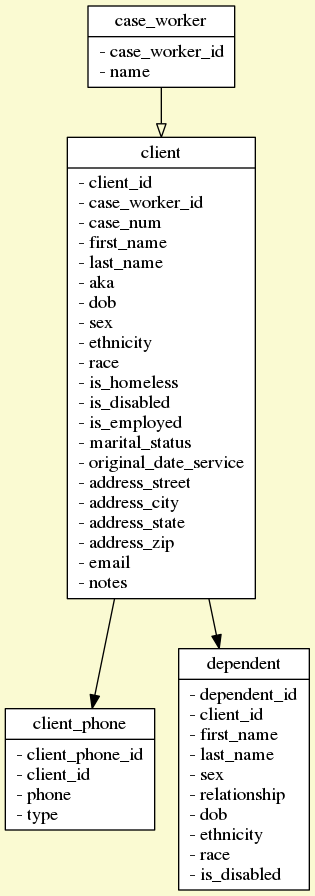

# Web Development with Perl 5

As of fall 2016, I still do all my web development in Perl 5 because the ecology of modules is so mature.  Here I will describe how I typically go about creating a website.  For example, I will reference a small project I built for an affordable housing non-profit in Tucson (https://github.com/kyclark/metagenomics-book/tree/master/web).  You can instantiate the entire website and database from the Github repo.

# Data Model

> Show me your flowcharts and conceal your tables, and I shall continue to be mystified. Show me your tables, and I won’t usually need your flowcharts; they’ll be obvious. -- Fred Brooks

Nothing captures my philosophy better than the above quote.  Everything in my method starts from the database design and is propagated by code outward.  I tend to use MySQL with InnoDB tables so that my database has foreign key constraints.  (The only time I don't use InnoDB is when I need a feature like FULLTEXT indexes.)  

Here is an example schema:

```
SET foreign_key_checks=0;

drop table if exists case_worker;
create table case_worker (
  case_worker_id int unsigned NOT NULL AUTO_INCREMENT PRIMARY KEY,
  name varchar(100)
) ENGINE=InnoDB;

drop table if exists case_worker_to_client;

drop table if exists client_phone;
create table client_phone (
  client_phone_id int unsigned NOT NULL AUTO_INCREMENT PRIMARY KEY,
  client_id int unsigned not null,
  phone varchar(50),
  type varchar(50),
  foreign key (client_id) references client (client_id) on delete cascade
) ENGINE=InnoDB;

drop table if exists client;
create table client (
  client_id int unsigned NOT NULL AUTO_INCREMENT,
  case_worker_id int unsigned default null,
  case_num int unsigned not null default 0,
  first_name varchar(100) DEFAULT NULL,
  last_name varchar(100) DEFAULT NULL,
  aka varchar(100) default null,
  dob date default null,
  sex enum('U', 'M', 'F') null default 'U',
  ethnicity varchar(50) default null,
  race varchar(50) default null,
  is_homeless enum('Y', 'N') default 'N',
  is_disabled enum('Y', 'N') default 'N',
  is_employed enum('Y', 'N') default 'N',
  marital_status varchar(100),
  original_date_service date default null,
  address_street varchar(100) default null,
  address_city varchar(100) default null,
  address_state varchar(100) default null,
  address_zip varchar(100) default null,
  email varchar(255) default null,
  notes text,
  KEY last_name (last_name),
  foreign key (case_worker_id) references case_worker (case_worker_id) on delete cascade,
  PRIMARY KEY (client_id)
) ENGINE=InnoDB;

drop table if exists dependent;
create table dependent (
  dependent_id int unsigned NOT NULL AUTO_INCREMENT primary key,
  client_id int unsigned NOT NULL,
  first_name varchar(100) DEFAULT NULL,
  last_name varchar(100) DEFAULT NULL,
  sex enum('U', 'M', 'F') null default 'U',
  relationship varchar(100) DEFAULT NULL,
  dob date default null,
  ethnicity varchar(50) default null,
  race varchar(50) default null,
  is_disabled enum('Y', 'N') default 'N',
  foreign key (client_id) references client (client_id) on delete cascade
) ENGINE=InnoDB;
```

Here is a picture of the database:



Some of my rules for database nomenclature:

1. Name tables in the singular
2. Define a primary key as an auto-incrementing field with a combination of the table name + "\_id." Avoid using this suffix as much as possible, but I may exceptions for "pubmed_id" or "genbank_id" where the ID is in some external database.
3. Use "is\_" as a prefix for Boolean fields, e.g., "is_disabled" so that you can write ```$client->is_disabled```
4. Use "ENUM" where possible to constrain data input, e.g., ```sex enum('U', 'M', 'F')```
5. Define reasonable defaults where possible, "sex" can default to "U" for "unknown/undefined"

Once I have a database, I use SQL::Translator (http://search.cpan.org/dist/SQL-Translator) to generate my object-relational model (ORM).  SQLT was a module I created to help me translate MySQL schemas to Oracle.  With the help of dozens of others, it expanded to be able to create documentation, images (such as the above E/R diagram), and code directly from schema definitions.  Here I have a script that digests the tables, fields, and relationships directly from the schema to create DBIx::Class (http://search.cpan.org/dist/DBIx-Class) modules for interacting with the database.

```
#!/usr/bin/env perl

use strict;
use warnings;
use autodie;
use feature 'say';
use DBIx::Class::Schema::Loader qw/ make_schema_at /;
use FindBin '$Bin';
use File::Path 'mkpath';
use File::Spec::Functions 'canonpath';
use Getopt::Long;
use Compass::DB;
use Pod::Usage;
use Readonly;

my $out_dir = "/usr/local/compass/lib";
my $debug   = 0;
my ( $help, $man_page );
GetOptions(
    'd|debug' => \$debug,
    'help'    => \$help,
    'man'     => \$man_page,
) or pod2usage(2);

if ( $help || $man_page ) {
    pod2usage({
        -exitval => 0,
        -verbose => $man_page ? 2 : 1
    });
}; 

if (!-d $out_dir) {
    mkpath $out_dir;
}

my $db = Compass::DB->new;

make_schema_at(
    'Compass::Schema',
    {
        debug          => 0,
        dump_directory => $out_dir,
        use_moose      => 1,
        overwrite_modifications => 1,
    },
    [ $db->dsn, $db->user, $db->password ]
);

__END__

# ----------------------------------------------------

=pod

=head1 NAME

mk-dbix.pl - creates the DBIx::Schema classes

=head1 SYNOPSIS

  mk-dbix.pl 

Options:

  -o|--out    Output directory (defaults to ../lib)
  -d|--debug  Show debug info
  --help      Show brief help and exit
  --man       Show full documentation

=head1 DESCRIPTION

Reads the configured "imicrobe" db and creates the DBIx::Class schema.

=head1 SEE ALSO

DBIx::Class.

=head1 AUTHOR

Ken Youens-Clark E<lt>E<gt>.

=head1 COPYRIGHT

Copyright (c) 2014 Ken Youens-Clark

This module is free software; you can redistribute it and/or
modify it under the terms of the GPL (either version 1, or at
your option, any later version) or the Artistic License 2.0.
Refer to LICENSE for the full license text and to DISCLAIMER for
additional warranty disclaimers.

=cut
```

After I run this, I have a complete ORM that I can use to avoid writing SQL (structure query language).  This lets me interact with the database using objects that abstract the nitty-gritty of database-specific SQL.  E.g., I could easily move from MySQL to PostgreSQL.

# Mojolicious

Using SQL::Translator and DBIx::Class, I avoid writing pretty much anything to do with data access.  Now to employ the same level of laziness to avoid writing a website, I'll use Mojolicious (http://search.cpan.org/dist/Mojolicious).  I tend to write in typical REST (https://en.wikipedia.org/wiki/Representational_state_transfer) fashion, so "/object/verb" (e.g., "/client/list" or "/client/view/:client_id"), and I use the MVC (model-view-controller) layout (<https://en.wikipedia.org/wiki/Model-view-controller>) where the Model is the database/ORM, the view is Template Toolkit template (http://search.cpan.org/dist/Template-Toolkit), and the Controller is a Mojolicious module.

In Mojolicious (in "mojo/lib/Compass.pm"), I define routes for each endpoint that point to "Compass::Controller::[Object]" classes.  The methods in the classes correspond to the [verb]s that I define, and the template for the view is in "templates/[object]/[verb]."  For example, the endpoint "/client/list" has a model of "Compass::Controller::Client::list" and the view is controlled with "/templates/client/list."

# Helper modules

In "lib", you'll find a few helper modules I create to abstract the configuration (Compass::Config) and database access (Compass::DB).  I like to use Moose (http://search.cpan.org/dist/Moose) as uses a declarative syntax very much in the style of Perl 6 to create object attributes and methods.  All the "Schema" code in "lib/Compass" is the parts that are generated by the above schema dumper. 

# Interface

For the user interface, I like to use Bootstrap (http://getbootstrap.com) for CSS (cascading style sheets) and a smattering of jQuery (https://jquery.com) and other modules like Google Maps for interactivity.  I tend to stick with the simplest possible forms and views so that pages load quickly; also, I'm usually in a hurry to write these things, so I often just re-use whatever I wrote before.  If I need some sort of user-generated documentation site, I'll probably create a separate site like "docs.foo.org" install Wordpress or Drupal.  Whatever might constitute my style is evident on sites like Gramene.org and imicrobe.us.

# Infrastructure

I used Apache as my web server for the longest time, but in the last couple of years I only use Nginx.  Perhaps accidentally creating an open proxy with Apache and then getting absolutely hammered for a few weeks soured me on Apache.  My servers are usually CentOS, and I rely a fair amount on pre-built packages for most things I need with the exception of Perl which I like to compile from source and stay on the very latest release as much as possible.  It's nice to use virtual machines to segregate services, e.g., the databases (MySQL), the web servers (Nginx, PHP, Perl), search engines (MongoDB, esp., as it will eat pretty much all available resources).